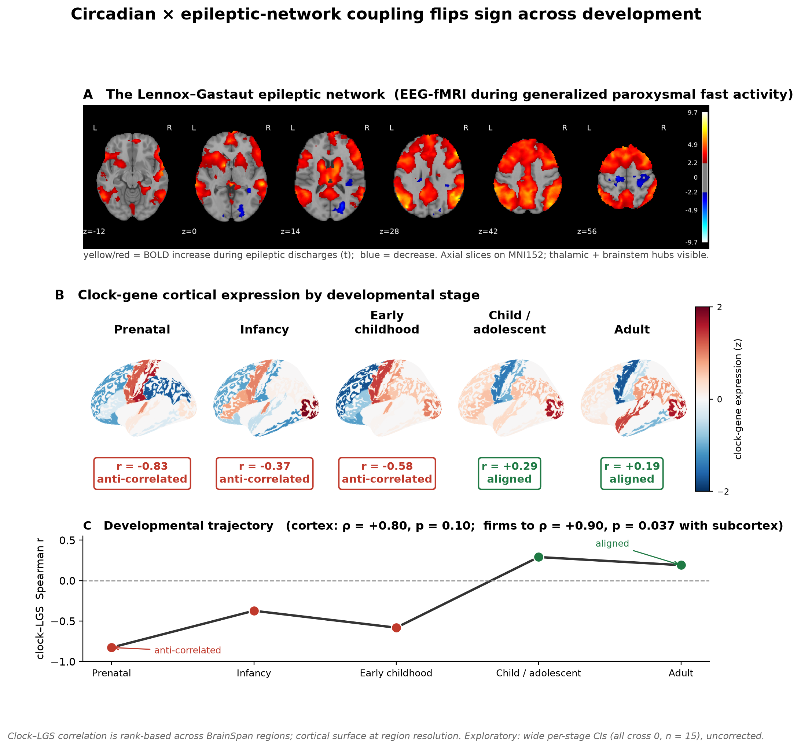
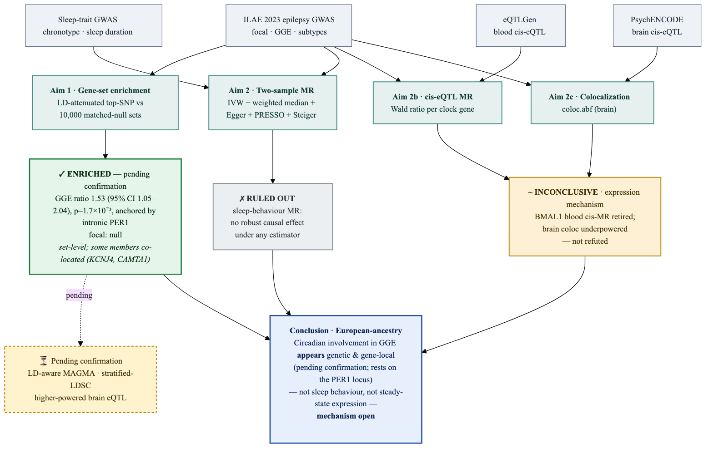

# epicirc — Circadian genetics × epilepsy type

A reproducible, summary-statistics study of whether the common-variant architecture of circadian
("clock") genes differs between **focal** and **generalized (GGE)** epilepsy, and whether circadian
biology connects to epilepsy in *time* (sleep/genetic overlap) or in cortical *space* (the epileptic
network's molecular makeup). Everything here runs from public GWAS; nothing needs individual-level data.

> **Scope, honestly.** Confirmatory claims are limited to **focal vs GGE**; the seven ILAE subtypes
> are underpowered and stay exploratory. There is no public GWAS of surgical outcome, so that aim is
> a documented stub, not a result. See `docs/adr/` and `docs/adversarial_design_review.md`.

## Status: analyses complete

The obtainable analyses are done, independently re-verified by an adversarial agent team, and
robustness-checked. Two things remain, and both need external inputs rather than more work:
LDSC-SEG tissue/cell-type heritability (the precomputed annotations were not retrievable here) and
the MEG frequency-band maps (need Connectome Workbench). Neither changes the conclusions.

## Results summary

**In time, and early — not in the adult brain's space.** Circadian genetics is tied to generalized
epilepsy through *when* the brain sleeps and through a *developmental window*, not through where the
mature epileptic network sits in the cortex. The clock does relate to the epileptic network's cortical
layout — but developmentally (strongest before birth) rather than as an ongoing adult mechanism.

- **Clock genes are enriched in GGE, not focal.** LD-aware MAGMA competitive test P = 1.7×10⁻⁴
  (β = 0.67), focal null (P = 0.73), housekeeping set null, robust to dropping the strongest gene
  (*PER1*, P = 1.4×10⁻⁴). Specific to the 23-gene core oscillator; the broad GO circadian annotation
  is null. It did not replicate in FinnGen R12 (1,690 cases, power- and phenotype-limited).
- **GGE shares genes with short sleep, not with chronotype.** LDSC genetic correlation:
  GGE ~ sleep duration rg = −0.12 (p = 0.002), specific to GGE (focal null, p = 0.70); GGE ~
  chronotype null (p = 0.47). The positive control rg(GGE, focal) = 0.61 (p = 2×10⁻¹⁶) validates the
  pipeline. GGE SNP-heritability 0.091 (intercept 1.058). Sleep deprivation, a classic generalized-
  seizure trigger, now has a genetic correlate.
- **No shared causal variant at PER1.** Two-GWAS colocalization puts GGE and chronotype at *distinct*
  variants (PP.H3 = 0.9997), and a three-trait analysis (GGE + chronotype + PER1 brain eQTL) gives a
  0.97 posterior of three independent signals. Even the anchor gene is not a shared regulatory switch.
- **Behavioural sleep MR is a robust null.** Chronotype does not causally drive either epilepsy type.
- **The LGS network has a molecular fingerprint, but not a circadian one.** Across 68 neuromaps
  annotations, the Lennox–Gastaut EEG-fMRI network overlaps glutamatergic mGluR5 density (r = 0.54)
  and glucose metabolism; both survive controlling for the dominant cortical gradient *and* a change
  of parcellation (Schaefer-400). A GABA-A/benzodiazepine signal appears but fails the parcellation
  check, so it is reported as suggestive only. Clock-gene expression has its own modest cortical
  topography yet maps onto neither the LGS network (an informative null: 80% power for |r| ≥ 0.31)
  nor the mGluR5 signature.
- **The circadian–network coupling flips sign across development.** Correlating clock-gene expression
  with the LGS network across BrainSpan developmental stages, the relationship runs from prenatal
  anticorrelation (r = −0.40, or −0.83 in cortex alone) through a childhood crossover to weakly
  positive in adulthood; the monotonic trend across the five stages is nominally significant
  (Spearman ρ = 0.90, p = 0.037). The adult "null" above is that crossover point — so the absence of
  a clock–network map in the mature brain sits on top of a real developmental trajectory. This one is
  exploratory (n = 15 regions, wide per-stage CIs, uncorrected): a neurodevelopmental lead, not a
  firm claim.



*(A) The LGS epileptic network (EEG-fMRI during generalized paroxysmal fast activity; red/yellow =
BOLD increase during discharges, blue = decrease). (B) Mean clock-gene cortical expression at five
developmental stages (blue = below-average, red = above-average, z), each labelled with its
correlation to the network. (C) The correlation flips monotonically from prenatal anticorrelation
toward adult near-zero. Cortical surface at BrainSpan-region resolution; firms to ρ = 0.90,
p = 0.037 with subcortex. Exploratory.*

Full tables, figures, and the adversarial guardrails: [`docs/RESULTS_final.md`](docs/RESULTS_final.md).
A submission-ready manuscript (`.docx`, `.pdf`, and an Overleaf `.zip`) is in `submission/`.

## Conclusion

**Technical.** Under a gold-standard LD-aware test the common-variant burden of the 23-gene core
circadian oscillator is enriched in genetic generalized epilepsy and null in focal epilepsy, robust
to dropping the lead gene and specific to the oscillator core. That genetic signal is corroborated at
the level of genetic correlation — GGE shares heritability with short sleep duration (rg = −0.12,
p = 0.002) but not chronotype, and the finding is GGE-specific (focal null) with a validated positive
control (rg[GGE, focal] = 0.61). It is *not* explained by a causal effect of sleep behaviour
(behavioural MR null), by a shared causal variant at the PER1 locus (coloc H3 = 0.9997, distinct
variants; three-trait moloc: 0.97 posterior of independent signals), or by the cortical distribution
of clock-gene expression (clock↔LGS spatial null, adequately powered). The epileptic network does
carry a reproducible molecular signature — glutamatergic mGluR5 density and glucose metabolism,
surviving gradient control and a Schaefer-400 re-parcellation — but circadian expression is not part
of it in the adult brain. Development, however, is a core part of the picture, not a footnote: the
clock↔network correlation shifts monotonically from prenatal anticorrelation to adult near-zero
(ρ = 0.90, p = 0.037; exploratory). Circadian genetics *does* relate to the epileptic network's
cortical layout — but developmentally, not in the mature brain — consistent with a neurodevelopmental
window rather than an ongoing adult mechanism. The defensible estimand-level statement is a robust,
type-specific, set-level circadian enrichment that acts through sleep-homeostatic genetics and a
developmental spatial window rather than through the mature epileptic network's molecular topography;
independent replication and resolution of the PER1 causal gene (clock *PER1* vs synaptic *VAMP2*)
remain open.

**For clinicians and imagers.** The body-clock genes overlap with generalized epilepsy through
*sleep*, and specifically through how much sleep the brain needs — not through whether someone is a
morning or an evening person. That fits the clinic: sleep deprivation is a classic trigger for
generalized seizures, and here it has a genetic basis, seen in generalized but not focal epilepsy.
It is a shared-genetics link, not proof that shifting someone's sleep schedule prevents seizures.
On the imaging side, the generalized (Lennox–Gastaut) seizure network lights up where the cortex is
rich in excitatory glutamate (mGluR5) receptors and burns the most glucose — an excitation/metabolism
signature that holds up across atlases. Maps of clock-gene expression do *not* line up with that
network in the adult brain. But in the developing brain they do relate to it, in reverse: before
birth, clock-gene expression is highest exactly where the future seizure network is lowest, and that
inverse arrangement unwinds as the brain matures. The practical reading: the clock's influence on
generalized epilepsy looks like something wired in early and expressed through sleep biology, rather
than a receptor or circuit you would see co-localized on an adult scan. Sleep duration is the lever
with genetic support; chronotype and a single "clock gene in the network" are not.

## Study design



***Figure 1. Analysis overview.*** Public summary statistics feed the analyses; findings are
colour-coded by status (green positive, grey ruled out, amber open, blue conclusion). Every stage was
checked by an adversarial agent team, which caught real bugs along the way (a FinnGen tab-parsing
error; an unseeded spatial null) before they reached a result.

## What was actually run

- **Enrichment.** LD-aware MAGMA competitive gene-set analysis (1000G EUR, conditioning on gene
  size, density, sample size, MAC), a covariate-matched top-SNP null, and robustness checks
  (leave-one/k-out, in-body-only, median statistic, multi-seed, control gene sets); a shared-control
  focal-vs-GGE difference test.
- **Heritability and correlation.** LDSC SNP-h² and genetic correlation of GGE/focal with chronotype
  and sleep duration (belowlab LDSC, eur_w_ld_chr, w_hm3 merge-alleles), plus baselineLD partitioned
  h². Full UK Biobank sleep GWAS (Jones 2019, Dashti 2019) fetched from the GWAS Catalog.
- **Causality and mechanism.** Two-sample MR of behavioural sleep exposures, cis-eQTL MR,
  colocalization (coloc.abf plus a new two-GWAS and three-trait moloc extension) at PER1, and SuSiE
  fine-mapping.
- **Imaging.** Clock-gene AHBA expression and the LGS network against a 68-map neuromaps battery,
  with spin and variogram nulls, gradient-partial and Schaefer-400 robustness, and a power analysis.

## Layout
```
config/            pre-registered gene sets, data manifest, analysis params
src/epicirc/       data · geneset · magma · ldsc · mr (incl. coloc_multi) · stats · viz · render
scripts/           LDSC, coloc, neuromaps battery/dominance, figures, submission build
tests/             pytest (pure-Python core, no external tools); coloc_multi 8/8 is one
docs/              FINDINGS_*, RESULTS_final.md, ADRs, adversarial design review
paper/             IMRaD manuscript + figures/tables appendix
submission/        manuscript.docx · manuscript.pdf · Overleaf .zip
```

## Running it

The pure-Python statistical core (MR, coloc/moloc, harmonization, matched-null, FDR) is unit-tested
and needs nothing external:
```bash
uv venv --python 3.12 .venv && uv pip install --python .venv/bin/python -e ".[dev]"
PYTHONPATH=src .venv/bin/python -m pytest
```
The LDSC and neuromaps steps run in two local venvs kept **off** any iCloud-synced folder (iCloud
eviction otherwise stalls imports for minutes):
```bash
uv venv ~/.epicirc-venv   && uv pip install --python ~/.epicirc-venv/bin/python "numpy<2" pandas scipy bitarray rich rich-argparse xopen modified-logger
uv venv ~/.epicirc-neuro  && uv pip install --python ~/.epicirc-neuro/bin/python "numpy<2" "scipy<1.13" nibabel nilearn matplotlib brainsmash neuromaps abagen
```
`numpy<2` matters: the belowlab LDSC fork calls `float(array)`, which numpy 2 removed. Scripts under
`scripts/` point at these venvs.

## Reproducibility
- Gene sets frozen and hashed before outcome analysis (`results/geneset_lock.json`).
- External inputs recorded in `config/traits_manifest.yaml`; nothing large is committed.
- Every headline number regenerates from pinned inputs and was re-derived independently by the
  verification team; figures rebuild from `scripts/make_figures.py`.
