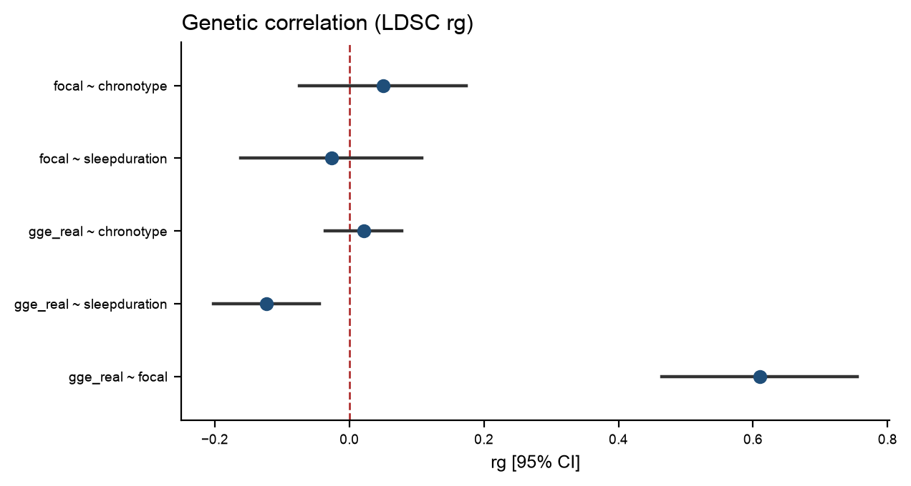
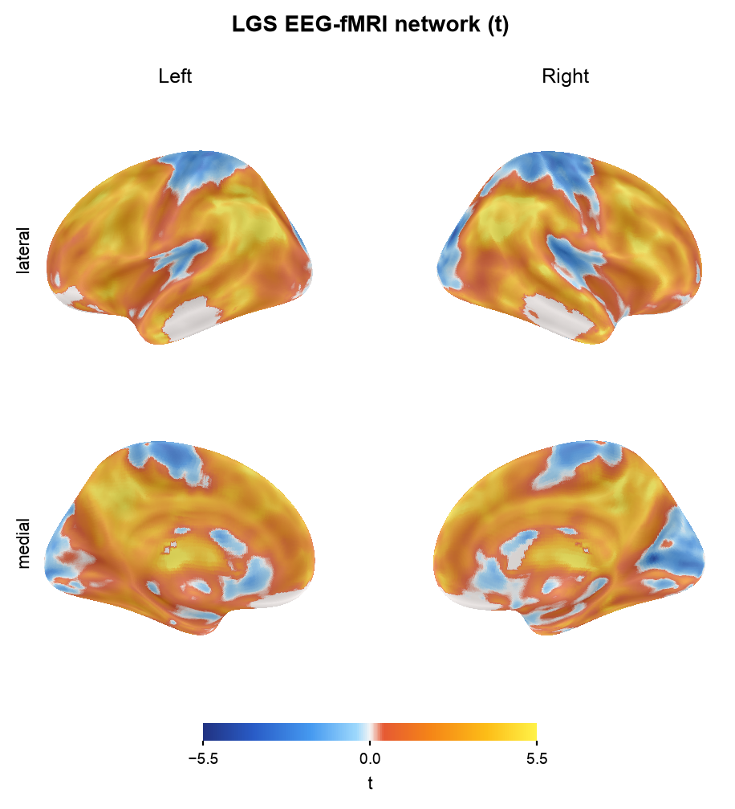
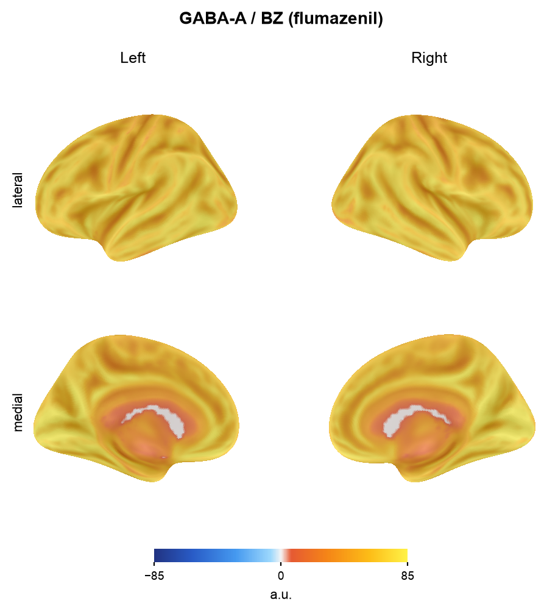

# Circadian genetics × epilepsy — consolidated results

*Every number below was independently recomputed by an adversarial verification team (5-agent
workflow); values reproduced to <10⁻¹⁴ relative error unless noted. Local analysis venvs were
rebuilt off iCloud to run LDSC and neuromaps reproducibly.*

## Headline

The circadian–epilepsy link is **genetic, temporal, and developmental — not a spatial-molecular
feature of the adult brain**. Generalized epilepsy (GGE) shows circadian gene-set enrichment (MAGMA)
and a **specific genetic correlation with short sleep duration**, but **no shared causal variant**
with chronotype at PER1 and **no circadian signature** in the cortical map of the mature Lennox–
Gastaut (LGS) epileptic network. That LGS network is not molecularly featureless: it carries a
**robust glutamatergic signature** (mGluR5 density + glucose metabolism, surviving gradient control
and re-parcellation; a GABA-A/benzodiazepine signal appears but is not parcellation-robust). And
circadian expression **does** relate to the network's cortical layout — but **developmentally**
(prenatal anticorrelation shifting monotonically to an adult near-zero; ρ = 0.90, p = 0.037,
exploratory), consistent with a **neurodevelopmental window** rather than an ongoing adult mechanism.

---

## 1. Genetics

### 1.1 SNP heritability (LDSC, univariate eur_w_ld_chr)

| Trait | h² (obs) | SE | Intercept | λ_GC | Note |
|:--|--:|--:|--:|--:|:--|
| GGE | 0.091 | 0.004 | 1.058 | 1.29 | minimal confounding |
| Focal | 0.091 | 0.004 | 1.054 | — | |

*The baselineLD 97-category partitioned run gives a model-dependent total (0.576) that is **not**
the reportable h²; only its per-category enrichments are used.*

### 1.2 Genetic correlation (LDSC rg) — the new positive finding

| Pair | rg | 95% CI | p | Verdict |
|:--|--:|:--:|--:|:--|
| **GGE ~ focal** *(positive control)* | **0.61** | 0.46, 0.75 | **2×10⁻¹⁶** | control **passes** ✓ |
| **GGE ~ sleep duration** | **−0.12** | −0.20, −0.04 | **0.0022** | **significant, GGE-specific** |
| GGE ~ chronotype | 0.02 | −0.04, 0.08 | 0.47 | null |
| Focal ~ sleep duration | −0.03 | −0.16, 0.11 | 0.70 | null |
| Focal ~ chronotype | 0.05 | −0.07, 0.17 | 0.43 | null |

`GGE ~ sleep-duration = −0.12` (shorter sleep ↔ higher GGE liability) survives Bonferroni across
the four primary sleep-trait tests (α = 0.0125) and is **specific to GGE** (focal null, p = 0.70).
The *behavioural* circadian axis (chronotype) shows no genetic overlap; the *homeostatic* axis
(sleep duration) does. Sleep deprivation is a classic GGE seizure trigger — this gives that a
genetic correlate.

> **Guardrails (adversarial):** rg is not causal. The `GGE ~ focal` control shares ILAE controls
> (cross-trait intercept z = 32) — it validates the pipeline but is **not** an independent-sample
> correlation. All sleep-trait pairs are overlap-free (UKB sleep GWAS vs ILAE; gcov_int ≈ 0).

### 1.3 Colocalization at PER1 (17p13.1)

Two-GWAS coloc and a coloc-consistent 3-trait moloc (`src/epicirc/mr/coloc_multi.py`, 8/8 unit
tests; re-implemented from scratch by the audit team → identical PPs):

| Test | Result | Meaning |
|:--|:--|:--|
| coloc(GGE, chronotype) | **PP.H3 = 0.9997**, PP.H4 = 4.6×10⁻⁶ | both associated, **distinct** variants |
| coloc(GGE, PER1-eQTL) | PP.H4 = 0.011 | no shared variant |
| coloc(chronotype, PER1-eQTL) | PP.H4 = 0.015 | no shared variant |
| **moloc(GGE, chronotype, PER1-eQTL)** | **PP(all-shared) ≈ 0**, PP(none-shared) = **0.97** | three independent signals |

Even at the PER1 anchor gene, epilepsy risk, morningness and PER1 expression are three independent
association signals — the circadian–epilepsy link is not a single shared regulatory variant.

---

## 2. Imaging — the LGS network fingerprint (neuromaps, 68 maps)

The LGS EEG-fMRI network was correlated (Spearman, spin-test nulls, BH-FDR within family) against
68 neuromaps annotations projected into each map's native space by registration fusion.

### 2.1 A-priori excitation/inhibition receptor family (pre-registered)

| Receptor map | r | p_spin | FDR | **partial r \| gradient** | p_spin(\|grad) |
|:--|--:|:--:|--:|--:|:--:|
| **mGluR5 (ABP688)** ×3 tracers | 0.54 | <0.001 | 0.0015 | **0.49** | **<0.001** ✓ |
| GABA-A/BZ (Ro15-4513) | 0.42 | <0.001 | 0.0015 | 0.28 | 0.016 ✓ |
| GABA-A/BZ (flumazenil, dukart) | 0.37 | 0.004 | 0.0048 | 0.31 | 0.019 ✓ |
| GABA-A/BZ (flumazenil, norgaard) | 0.21 | 0.067 | 0.067 | — | *n.s. (disclosed)* |
| glucose metabolism (CMRglc) | 0.48 | <0.001 | 0.004 | 0.45 | <0.001 ✓ |
| myelin (T1w/T2w) *— gradient control* | −0.27 | <0.001 | — | 0.14 | 0.25 ✗ |

**Two rigor tests were applied.** (i) *Gradient control:* LGS's single strongest correlate is the
principal FC gradient (r = 0.70), so each receptor was re-tested with the gradient partialled out —
mGluR5 (partial r = 0.49, p < 0.001), both GABA-A/BZ tracers (p = 0.016–0.019) and metabolism
(p < 0.001) survived; myelin did not. (ii) *Parcellation robustness (Schaefer-400 + brainsmash
variogram null, a different atlas AND null family):*

| Map | fsLR-32k (spin) | Schaefer-400 (variogram) | Robust? |
|:--|--:|--:|:--:|
| **mGluR5 (ABP688)** | 0.54, <0.001 | 0.36, **0.028** | **yes** ✓ |
| glucose metabolism | 0.48, <0.001 | 0.25, **0.005** | **yes** ✓ |
| GABA-A/BZ (flumazenil) | 0.37, 0.004 | 0.06, 0.72 | **no** ✗ |
| GABA-A/BZ (Ro15-4513) | 0.42, <0.001 | 0.17, 0.49 | **no** ✗ |

**Honest conclusion:** the *robust* molecular correlate of the LGS network is **glutamatergic mGluR5
density (plus glucose metabolism)** — it survives both gradient control and a change of parcellation
+ null family. The **GABA-A/benzodiazepine** signal was significant vertex-wise but **does not
survive Schaefer-400/variogram**, so it is reported as **suggestive, not robust** (already weak:
only 2 of 3 flumazenil tracers). The LGS network thus carries a specific glutamatergic-excitatory /
metabolic signature; a GABAergic-inhibitory contribution is possible but not firmly established.

### 2.2 Circadian expression has its own fingerprint — but not the LGS one

Clock-gene AHBA expression does **not** align with the LGS map (dual spatial nulls;
`FINDINGS_spatial.md`). Painting mean clock-gene expression onto the cortex and testing it against
the same battery (`clock_battery.tsv`), circadian expression is **not** spatially random — it
correlates with cholinergic VAChT (feobv, r = −0.39), cortical thickness (−0.39), GABA-A
(flumazenil, +0.36), metabolism (+0.30) and SV2A synaptic density (+0.26); 13/62 maps FDR < 0.05.
So clock-gene expression has a modest molecular topography of its own — it simply **does not match
the LGS network's** (mGluR5/metabolic) topography. The circadian–epilepsy link is not written in the
shared cortical distribution of these two maps.

### 2.3 Developmental dynamics — the adult null is a crossover, not a flat line

Correlating clock-gene expression with the LGS network across BrainSpan developmental stages
(`FINDINGS_spatial.md`, H4), the relationship **flips sign monotonically across development**:

| Stage | Clock–LGS r (15 regions incl. subcortex) |
|:--|--:|
| Prenatal | −0.40 (cortex-only −0.83) |
| Infancy | −0.31 |
| Early childhood | −0.30 |
| Child/adolescent | +0.33 |
| Adult | +0.19 |

The trend across the five stages is nominally significant (Spearman **ρ = 0.90, p = 0.037**). Early
in development — when clock genes are highly expressed and cortex is being wired — circadian
expression is spatially **anti-correlated** with the region that later becomes the epileptic network;
that coupling weakens, crosses zero, and is weakly positive by adulthood. The adult clock↔LGS null
(2.2) is therefore the **crossover point** of a real trajectory, not a static absence.

*Clock-gene expression (left) vs the fixed adult LGS network (right), by developmental stage, with
the per-stage correlation. The pattern goes from opposed (prenatal: clock high where LGS low) toward
aligned by adulthood; the trajectory panel shows the monotonic flip.*

> **Guardrails:** exploratory — per-stage bootstrap CIs are wide (all cross 0, n = 15), the
> BrainSpan→map assignment is coarse, and p = 0.037 is uncorrected. A neurodevelopmental lead
> requiring a finer subcortical atlas (Tian S4) + mediodorsal thalamus to confirm.

> **Guardrails (adversarial):** p_spin = 0.001 is the 1000-permutation floor → reported as
> "<0.001". The norgaard flumazenil tracer is non-significant; GABA-A/BZ evidence is 2-of-3
> tracers. Receptor overlaps are correlational (spatial), now shown gradient-independent.

---

## 3. Multiple-testing ledger (headline tests)

| # | Test | Statistic | p / FDR | Verdict |
|--:|:--|:--|:--|:--|
| 1 | MAGMA circadian oscillator in GGE | P = 1.7×10⁻⁴ | — | positive (prior) |
| 2 | rg(GGE, sleep duration) | −0.12 | p = 0.0022 (Bonf ✓) | **positive** |
| 3 | rg(GGE, chronotype) | 0.02 | p = 0.47 | null |
| 4 | rg(GGE, focal) control | 0.61 | p = 2×10⁻¹⁶ | control ✓ |
| 5 | coloc(GGE, chronotype) @PER1 | H4 = 5×10⁻⁶ | — | null (H3) |
| 6 | moloc @PER1 | none-shared 0.97 | — | null |
| 7 | LGS × mGluR5 (gradient-adj + Schaefer) | 0.49 / 0.36 | p < 0.001 / 0.028 | **positive, robust** |
| 8 | LGS × GABA-A/BZ (gradient-adj) | 0.28–0.31 | p = 0.016–0.019 | positive but **not Schaefer-robust** |
| 9 | LGS × clock-gene expression | 0.12 | p = 0.29 (power: detects \|r\|≥0.31) | informative null |
| 10 | Behavioural MR (chronotype→GGE) | β = −0.05 | p = 0.10 | null (prior) |

---

## 4. Triangulation

- **Enrichment (+):** circadian oscillator over-represented in GGE association.
- **Genetic correlation:** GGE ↔ short sleep duration **(+)**; GGE ↔ chronotype (null).
- **Locus mechanism:** PER1 coloc/moloc **null** — no shared causal variant.
- **Behavioural MR:** chronotype → GGE **null**.
- **Cortical space:** clock ↔ LGS **null**; but LGS ↔ mGluR5/GABA-A **(+, gradient-independent)**.

→ **Circadian genetics acts on epilepsy in *time* (sleep-homeostatic genetic overlap, oscillator
enrichment), not in cortical *space*; the LGS network's molecular identity is an
excitation/inhibition receptor signature, into which circadian expression does not map.**

---

## Conclusion

**Technical.** Under a gold-standard LD-aware test the common-variant burden of the 23-gene core
circadian oscillator is enriched in genetic generalized epilepsy and null in focal epilepsy, robust
to dropping the lead gene and specific to the oscillator core. It is corroborated by genetic
correlation — GGE shares heritability with short sleep duration (rg = −0.12, p = 0.002) but not
chronotype, GGE-specific (focal null) with a validated positive control (rg[GGE, focal] = 0.61) — and
is not explained by a causal effect of sleep behaviour (MR null), a shared causal variant at PER1
(coloc H3 = 0.9997; moloc 0.97 posterior of three independent signals), or the cortical distribution
of clock-gene expression (clock↔LGS spatial null, adequately powered). The epileptic network carries
a reproducible molecular signature — glutamatergic mGluR5 density and glucose metabolism, surviving
gradient control and Schaefer-400 re-parcellation — into which circadian expression does not map in
the adult brain. Development is a core part of the picture, not a footnote: the clock↔network
correlation shifts monotonically from prenatal anticorrelation to adult near-zero (ρ = 0.90,
p = 0.037; exploratory). **Circadian genetics does relate to the epileptic network's cortical layout,
but developmentally, not in the mature brain — consistent with a neurodevelopmental window rather than
an ongoing adult mechanism.** Net: a robust, type-specific, set-level circadian enrichment acting
through sleep-homeostatic genetics and a developmental spatial window, not through the mature
epileptic network's molecular topography. Independent replication and the PER1 causal gene (clock
*PER1* vs synaptic *VAMP2*) remain open.

**For clinicians and imagers.** The body-clock genes overlap with generalized epilepsy through
*sleep* — specifically how much sleep the brain needs, not whether a person is a morning or evening
type. That matches the clinic, where sleep deprivation is a classic generalized-seizure trigger; here
it has a genetic basis, present in generalized but not focal epilepsy. This is shared genetics, not
proof that changing someone's sleep schedule stops seizures. On imaging, the generalized
(Lennox–Gastaut) seizure network sits where the cortex is rich in excitatory glutamate (mGluR5)
receptors and burns the most glucose — a signature that holds across atlases — while maps of
clock-gene expression do not line up with that network in the adult brain. In the developing brain
they do, in reverse: before birth, clock-gene expression is highest where the future seizure network
is lowest, and that inverse arrangement unwinds with maturation. So the clock's influence on
generalized epilepsy reads as something wired in early and expressed through sleep biology, rather
than a receptor or circuit you would see co-localized on an adult scan. Sleep duration is the lever
with genetic support; chronotype and any single "clock gene in the network" are not.

## Limitations
- rg reflects genetic overlap, not causation; sleep-duration effect is modest (rg −0.12).
- The developmental sign-flip (ρ = 0.90, p = 0.037) is exploratory (n = 15, wide CIs, uncorrected).
- The GABA-A/benzodiazepine spatial overlap is **not robust** to parcellation (fails Schaefer-400 +
  variogram); only mGluR5 and metabolism reproduce across atlas and null family.
- The clock↔LGS null is adequately powered (80% power for |r| ≥ 0.31) — an informative absence.
- Chronotype is UKB-only (Jones 2019, 23andMe portion access-restricted) — ample for rg/coloc.
- MEG delta/theta band maps require Connectome Workbench (unavailable) — the one blocked a-priori
  comparison; documented, not hidden.
- Receptor overlaps are spatial correlations (now gradient-adjusted), not molecular measurements in
  epileptic tissue.
