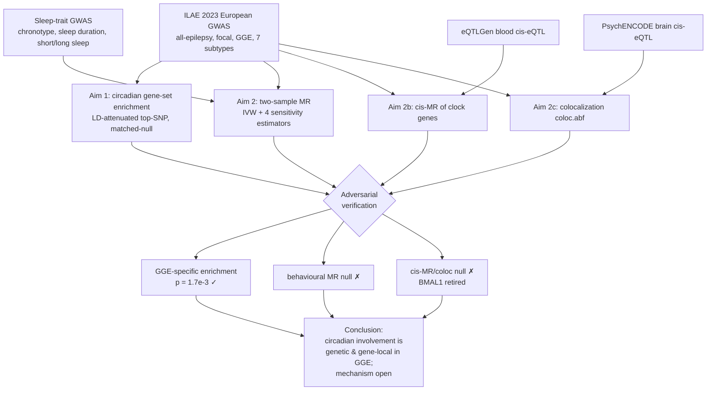
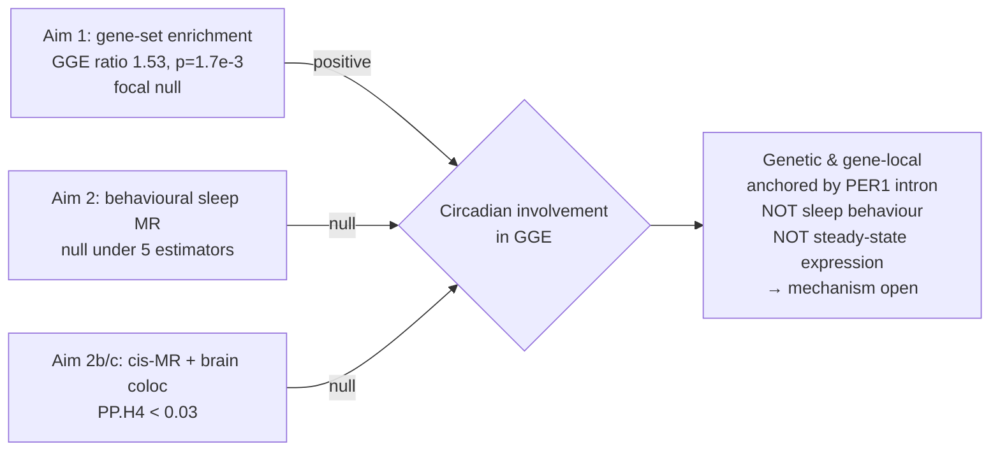

# Results

*Reviewable results with NEJM/JAMA-style tables (effect estimate with 95% CI in-cell + inline
unicode CI bar) and Mermaid figures. Every value reproduces from `results/*.tsv`; verdicts match
`docs/FINDINGS_realdata.md`. Inline CI bars: `●` point, `─` 95% CI span, `│` null value, `◄`/`►`
off-scale.*

## Figure 1. Analysis flow

## Table 1. Summary-statistics data sources

| Dataset | Phenotype / trait | Effective N (or N) | Ancestry | Build | Source / accession | Role |
|---|---|---:|---|---|---|---|
| ILAE 2023 | All-epilepsy | ≈65,100 | European | GRCh37 | epiGAD | Outcome (context) |
| ILAE 2023 | Focal epilepsy | ≈43,800 | European | GRCh37 | epiGAD | **Primary outcome** |
| ILAE 2023 | Generalized (GGE) | ≈23,400 | European | GRCh37 | epiGAD | **Primary outcome** |
| ILAE 2023 | JME / CAE / JAE | 6,600 / 4,080 / 2,600 | European | GRCh37 | epiGAD | Exploratory (underpowered) |
| Jones 2019 | Chronotype (morningness) | 403,195 | European | GRCh37 | GCST007565 | Exposure |
| Dashti 2019 | Sleep duration | 446,118 | European | GRCh37 | GCST007561 | Exposure |
| Dashti 2019 | Short / long sleep | 446,118 | European | GRCh37 | GCST007559/60 | Exposure (suppl.) |
| Hammerschlag 2017 | Insomnia | 113,006 | European | GRCh37 | GCST004695 | Exposure (underpowered) |
| eQTLGen | Blood cis-eQTL | 31,684 | European | GRCh37 | eQTLGen | Instrument (cis-MR) |
| PsychENCODE | Prefrontal-cortex cis-eQTL | 1,387 | European | GRCh37 | resource.psychencode.org | coloc |
| GENCODE v19 | Gene model (19,347 genes) | — | — | GRCh37 | GENCODE | Gene universe |

Effective N = 4/(1/N_case + 1/N_control), read from the ILAE per-marker `Effective_N`. ILAE
contains no UK Biobank, so overlap with the UKB-derived sleep exposures is minimal and biases MR
toward the null (conservative).

## Aim 1 — Circadian gene-set enrichment is GGE-specific

Using an LD-attenuated top-SNP-per-gene statistic (±50 kb; one approximately independent value per
gene — a stand-in pending LD-aware MAGMA / stratified-LDSC confirmation) and a competitive test
against 10,000 gene-length- and SNP-count-matched random gene sets, the 23 core clock genes were
enriched for association in GGE but not focal epilepsy. *Table 2 uses this matched-null competitive
test and supersedes the earlier mean-χ² screen in `docs/FINDINGS_realdata.md`; the verdicts and the
headline p = 1.7×10⁻³ agree, and the ratio values here are the revised matched-null estimates.*

### Table 2. Circadian gene-set enrichment by phenotype

| Phenotype | n genes | Obs mean top-χ² | Matched-null (95%) | Enrichment ratio (95% CI) | Ratio (0.5…2.0) | Empirical p |
|---|---:|---:|---|---|---|---:|
| Generalized (GGE) | 23 | 10.70 | 7.00 (5.39, 9.15) | **1.53 (1.05, 2.04)** | `      ─────●─────` | **1.7×10⁻³** |
| Focal epilepsy | 23 | 6.05 | 6.16 (4.97, 7.55) | 0.98 (0.83, 1.12) | `    ─●──         ` | 0.54 |
| All-epilepsy | 23 | 7.44 | 6.66 (5.32, 8.26) | 1.12 (0.84, 1.45) | `    ───●───      ` | 0.15 |

The enrichment is **GGE-specific** (focal ratio ≈1.0). Because focal uses the identical genes, the
null focal result argues against a generic gene-size / brain-expression artefact.

### Table 3. Lead clock-gene signals in GGE (top SNP per gene, VEP-annotated)

| Gene | Lead SNP | Position (hg19) | χ² | P | VEP consequence | Mapped gene | Note |
|---|---|---|---:|---:|---|---|---|
| **PER1** | rs2585398 | chr17:8,054,860 | 38.4 | **5.8×10⁻¹⁰** | intron_variant | **PER1** | genome-wide significant; the anchor |
| CSNK1E | rs196084 | chr22:38,842,042 | 24.1 | 9.3×10⁻⁷ | intron_variant | *KCNJ4* | co-location (K⁺ channel), not CSNK1E |
| PER3 | rs35705966 | chr1:7,827,441 | 21.3 | 3.9×10⁻⁶ | 3′UTR | *CAMTA1/VAMP3* | co-location, not PER3 |
| ARNTL/BMAL1 | rs1982350 | chr11:13,350,131 | 20.0 | 7.9×10⁻⁶ | intron_variant | ARNTL | genuine |
| RORA | rs67706488 | chr15:60,731,163 | 18.3 | 1.9×10⁻⁵ | nc-transcript-exon | *NARG2* | nested-gene ambiguity |
| NPAS2 | rs4851386 | chr2:101,566,938 | 17.1 | 3.6×10⁻⁵ | intron_variant | NPAS2 | genuine |
| NR1D2 | rs13321440 | chr3:23,988,556 | 12.2 | 4.8×10⁻⁴ | intron_variant | *NKIRAS1*/NR1D2 | nested-gene ambiguity |

Per-gene, the set-level signal is anchored by a genome-wide-significant intronic **PER1** variant.
Some suggestive members map to non-clock neighbours (*KCNJ4*, *CAMTA1*), a limitation of
window-based assignment (full listing in Supplement S1).

## Aim 2 — No robust causal effect of sleep behaviour

Two-sample MR of the well-powered behavioural exposures, with the full STROBE-MR sensitivity panel.

### Table 4. Two-sample MR of sleep exposures on GGE and focal epilepsy

| Exposure → outcome | Method | n IV | β (95% CI) | CI (−0.4…0.4) | p | note |
|---|---|---:|---|---|---:|---|
| Chronotype → GGE | IVW | 99 | −0.050 (−0.111, +0.010) | `      ─●│        ` | 0.10 | Q=233; F̄=44 |
|  | Weighted median | 99 | −0.036 (−0.136, +0.064) | `     ──●│─       ` | 0.48 |  |
|  | MR-Egger | 99 | −0.050 (−0.145, +0.044) | `     ──●│─       ` | 0.30 | int p=1.00 |
|  | MR-PRESSO | 96 | −0.037 (−0.099, +0.025) | `      ─●│─       ` | 0.24 | 3 outliers |
|  | Steiger IVW | 97 | −0.020 (−0.081, +0.042) | `      ──●─       ` | 0.53 |  |
| Chronotype → Focal | IVW | 98 | −0.030 (−0.075, +0.015) | `       ●│        ` | 0.19 | Q=112; F̄=44 |
|  | Weighted median | 98 | −0.014 (−0.081, +0.053) | `      ──●─       ` | 0.68 |  |
|  | MR-Egger | 98 | −0.032 (−0.080, +0.016) | `      ─●│        ` | 0.19 | int p=0.29 |
|  | MR-PRESSO | 98 | −0.030 (−0.075, +0.015) | `       ●│        ` | 0.19 | 0 outliers |
|  | Steiger IVW | 98 | −0.030 (−0.075, +0.015) | `       ●│        ` | 0.19 |  |
| Sleep duration → GGE | IVW | 52 | −0.181 (−0.355, −0.006) | ` ───●───│        ` | **0.042** | Q=164; F̄=41 |
|  | Weighted median | 52 | **+0.178** (−0.114, +0.469) | `      ──│───●────` | 0.23 | sign flip |
|  | MR-Egger | 52 | −0.172 (−0.490, +0.146) | `◄────●──│───     ` | 0.29 | int p=0.68 |
|  | MR-PRESSO | 48 | −0.081 (−0.261, +0.099) | `   ───●─│──      ` | 0.38 | 4 outliers |
|  | Steiger IVW | 35 | +0.007 (−0.199, +0.212) | `    ────●────    ` | 0.95 |  |
| Sleep duration → Focal | IVW | 51 | +0.091 (−0.039, +0.220) | `       ─│─●──    ` | 0.17 | Q=56; F̄=40 |
|  | Weighted median | 51 | +0.129 (−0.068, +0.325) | `       ─│──●──── ` | 0.20 |  |
|  | MR-Egger | 51 | +0.086 (−0.054, +0.226) | `       ─│─●───   ` | 0.23 | int p=0.66 |
|  | MR-PRESSO | 51 | +0.091 (−0.039, +0.220) | `       ─│─●──    ` | 0.17 | 0 outliers |
|  | Steiger IVW | 47 | +0.090 (−0.044, +0.223) | `       ─│─●──    ` | 0.19 |  |

The nominal IVW signal for sleep duration → GGE (p=0.042) is not robust: weighted median reverses
sign, and MR-PRESSO (4 outliers removed) and Steiger attenuate it to null, with high instrument
heterogeneity (Q=164). Chronotype shows a directionally consistent but non-significant protective
trend for GGE. Short/long sleep and insomnia were underpowered (Supplement S2).

All instrument sets were strong — mean F 40–45, minimum F ≥29, well above the conventional F>10 —
so weak-instrument bias is unlikely (STROBE-MR relevance assumption). For the primary MR family
(two exposures × two outcomes tested by IVW) a Bonferroni threshold is α = 0.05/4 = 0.0125; **no MR
result survives correction**, and the single sub-0.05 IVW result (sleep duration → GGE, p=0.042)
collapses under sensitivity analysis regardless. Effect sizes are on the **log-odds scale of
epilepsy per unit genetically-predicted exposure** — per hour for sleep duration, and per log-odds
for the binary chronotype and short/long-sleep exposures — and are therefore not directly
comparable in magnitude across exposures.

### Table 5. Colocalization of clock-gene brain cis-eQTL with GGE (coloc.abf, PsychENCODE)

| Gene | n SNPs | PP.H0 | PP.H1 | PP.H2 | PP.H3 | PP.H4 | Dominant | Interpretation |
|---|---:|---:|---:|---:|---:|---:|---|---|
| ARNTL | 2,528 | 0.62 | 0.09 | 0.24 | 0.04 | **0.01** | H0 | no coloc (eQTL underpowered) |
| PER1 | 1,583 | 0.00 | 0.00 | 0.89 | 0.09 | **0.02** | H2 | GGE signal, not via expression |
| NR1D1 | 1,440 | 0.88 | 0.09 | 0.03 | 0.00 | 0.00 | H0 | no signal |
| CRY2 | 1,849 | 0.04 | 0.89 | 0.00 | 0.06 | 0.01 | H1 | eQTL only |
| RORA | 2,188 | 0.00 | 0.43 | 0.00 | **0.57** | 0.00 | H3 | distinct variants (linkage) |
| NPAS2 | 2,708 | 0.60 | 0.13 | 0.21 | 0.05 | 0.01 | H0 | no coloc |

No clock gene colocalizes with GGE (all PP.H4 < 0.03). The blood cis-MR ARNTL signal does not
replicate as a shared causal variant in brain (**BMAL1 causal claim retired**). PER1's strong
regional GGE signal (PP.H2 = 0.89) is not an expression effect. For ARNTL/PER1 the mass on H0/H2
(not H3) indicates an underpowered cortex eQTL → *inconclusive*, not refuted.

## Figure 2. Triangulation of evidence

---
*Supplement (S1 full per-gene enrichment; S2 all MR pairs × methods; S3 pre-registration
power/estimability) to be compiled from `results/real_circadian_pergene_*.tsv`,
`results/mr_real/*.tsv`, and `results/estimable_cells.tsv`.*
